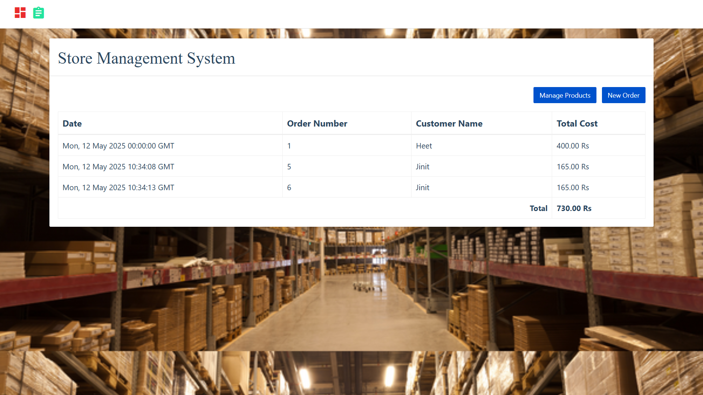

# 🛒 D Mart – Inventory Management System

A 3-tier Grocery Store Management System built using **Python, Flask, MySQL**, and **HTML/CSS/JavaScript**. This project allows you to manage inventory, sales, and customers through an interactive web interface.

---

## 🧱 Tech Stack

- **Frontend**: HTML, CSS, JavaScript, Bootstrap
- **Backend**: Python, Flask
- **Database**: MySQL

---

## 📸 Screenshot

---

## 🚀 Features

- Add, update, and delete inventory items
- Track stock levels and sales history
- Customer management
- Responsive web interface for ease of use
- Real-time updates from the database

## 🔧 Installation Instructions

- `pip install flask`
- `pip install mysql-connector-python`  

